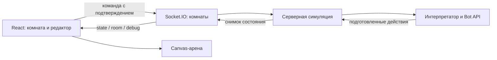

# Архитектура

## Структура репозитория

| Путь | Ответственность |
| --- | --- |
| `server/game/` | Сущности, фиксированные тики, движение, экономика, бой и AI |
| `server/scripting/` | Парсер DSL, интерпретатор, Bot API и пример программы |
| `server/network/rooms.js` | Комнаты, права, команды и рассылка состояния |
| `server/app.js` | Создание Express/Socket.IO-сервера и HTTP-маршруты |
| `server/index.js` | Адрес сервиса, запуск и завершение процесса |
| `frontend/client/src/App.jsx` | Подключение, состояние комнаты, редактора и навигации |
| `frontend/client/src/components/` | Canvas, редактор, справка, подсказки и визуальные элементы |
| `frontend/client/public/` | Статические файлы клиента |
| `docs/` | Документы проекта; `docs/agents/` — материалы ИИ-агентов |
| `artifacts/` | Скриншоты проверок и временные материалы; исключён из Git |

## Игровое состояние

Сервер определяет координаты, урон, ресурсы, создание сущностей и победителя. `Game` работает независимо от Socket.IO и проверяется напрямую в тестах. Сетевой слой передаёт команды в симуляцию и отправляет снимки клиентам.

## Исполнение программы

Исходник компилируется в AST; `eval` и `Function` не используются. API выдаёт ограниченные ссылки на цели, а действия сначала помещаются в очередь. Ошибка исполнения отменяет очередь конкретного бота за тик. Исчерпание бюджета оставляет уже подготовленные действия; следующая попытка начинается с первой строки.

Исходник и AST не включаются в общие снимки; ошибки и расход операций отправляются только владельцу через `debug`.

## Клиент и страницы

Клиент использует ES-модули, сервер — CommonJS. Навигация `/`, `/how-to-play`, `/reference` построена на History API; общий компонент приложения сохраняет подключение и черновик. Перезагрузка создаёт новую сессию. Express обслуживает прямые адреса страниц.

ЭЛТ-фильтр реализован поверх Canvas средствами CSS. Подсветка попадания рисуется на клиенте по снижению HP и не влияет на игровую механику.

## Изменение проекта

Добавляйте механику в `server/game/`, команды программы — в API и интерпретатор, сетевые действия — в `rooms.js`. Интерфейс отображает подтверждённое сервером состояние. Сохраняйте простую структуру без дополнительных сервисов и абстракций, если задача решается существующим модулем.
